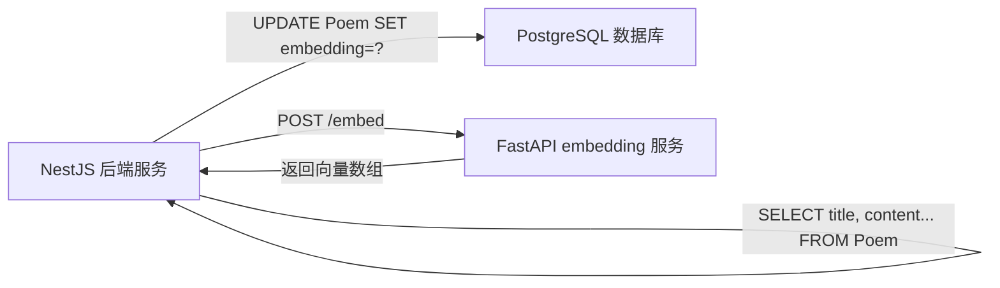

# IFS Plan

## Embedding

Nest.js 取数据 → 调用 Python FastAPI 获取 embedding → Nest.js 再更新数据库

```mermaid
graph LR
A[PostgreSQL 数据库]
B[NestJS 后端服务]
C[FastAPI embedding 服务]

B -->|SELECT title, content... FROM Poem| B
B -->|POST /embed| C
C -->|返回向量数组| B
B -->|UPDATE Poem SET embedding=?| A
```
